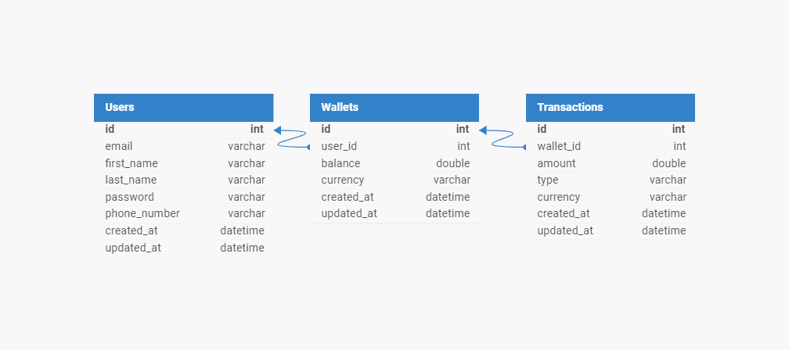

# Wallet and Transaction Management API

## Table of Contents

- [Introduction](#introduction)
- [Features](#features)
- [Technology Stack](#technology-stack)
- [ER Diagram](#er-diagram)
- [Installation](#installation)
- [Environment Variables](#environment-variables)
- [Running the Application](#running-the-application)
- [API Endpoints](#api-endpoints)
- [Testing](#testing)
- [License](#license)

## Introduction

This project is a RESTful API built with NestJS that handles wallet management, user authentication, and transaction processing. It includes functionalities for registering users, logging in, creating wallets, funding accounts, transferring funds, and withdrawing funds.

## Features

- **User Authentication**: Registration and login using JWT.
- **Wallet Management**: Create, fund, transfer, and withdraw from wallets.
- **Transaction Management**: Retrieve transactions by ID or user.
- **Security**: Secured endpoints using JWT and authorization guards.

## Technology Stack

- **Backend**: [NestJS](https://nestjs.com/)
- **Database**: [PostgreSQL](https://www.postgresql.org/)
- **ORM**: [TypeORM](https://typeorm.io/) or [Knex.js](http://knexjs.org/)
- **Authentication**: JWT (JSON Web Tokens)
- **Validation**: [class-validator](https://github.com/typestack/class-validator)

## ER Diagram



The ER diagram illustrates the relationships between the tables:

- **Users**: Stores user information.
- **Wallets**: Each wallet belongs to a user.
- **Transactions**: Records transactions related to wallets.

## Installation

To get started with the project, follow these steps:

1. **Clone the repository**:

   ```sh
   git clone https://github.com/thexovc/demo-credit-lendsqr.git
   cd demo-credit-lendsqr
   ```

2. **Install dependencies**:
   ```sh
   npm install
   ```

## Environment Variables

Create a `.env` file in the root directory and add the following variables:

```plaintext
DATABASE_HOST=localhost
DATABASE_PORT=5432
DATABASE_USER=your_db_user
DATABASE_PASS=your_db_password
DATABASE_NAME=your_db_name
JWT_SECRET=your_jwt_secret
ADJUTOR_SECRET=your_adjutor_secret
ADJUTOR_BASE_URL=adjutor_base_url
```

## Running the Application

To run the application locally:

1. **Start the PostgreSQL database** (ensure it matches the credentials in your `.env` file).

2. **Run migrations**:

   ```sh
   npm run migration:latest
   ```

3. **Start the application**:
   ```sh
   npm run start:dev
   ```

The application will be running on `http://localhost:3000`.

# API Documentation

## Auth Routes

### POST /v1/auth/register

Registers a new user.

- **URL**: `/v1/auth/register`
- **Method**: `POST`
- **Request Body**:

  - `email` (string, required): The user's email address.
  - `password` (string, required): The user's password.
  - `firstName` (string, required): The user's first name.
  - `lastName` (string, required): The user's last name.

- **Response**:

  - **Success**: Returns the created user object.
    ```json
    {
      "id": "1",
      "email": "user@example.com",
      "firstName": "John",
      "lastName": "Doe",
      "createdAt": "2023-06-18T00:00:00.000Z",
      "updatedAt": "2023-06-18T00:00:00.000Z"
    }
    ```
  - **Error**: Returns an error message if email is in Karma blacklist.

    ```json
    {
      "statusCode": 403,
      "message": "Email In Karma Blacklist"
    }
    ```

    ```

    ```

  - **Error**: Returns an error message if email already registered.
    ```json
    {
      "statusCode": 400,
      "message": "Email already registered"
    }
    ```

### POST /v1/auth/login

Logs in an existing user.

- **URL**: `/v1/auth/login`
- **Method**: `POST`
- **Request Body**:

  - `email` (string, required): The user's email address.
  - `password` (string, required): The user's password.

- **Response**:
  - **Success**: Returns an access token.
    ```json
    {
      "accessToken": "jwt_token",
      "data": {
        "id": "1",
        "email": "user@example.com",
        "firstName": "John",
        "lastName": "Doe",
        "createdAt": "2023-06-18T00:00:00.000Z",
        "updatedAt": "2023-06-18T00:00:00.000Z"
      }
    }
    ```
  - **Error**: Returns an error message if the login fails.
    ```json
    {
      "statusCode": 401,
      "message": "Unauthorized"
    }
    ```

---

## User Routes

### GET /v1/users

Retrieves the details of the authenticated user.

- **URL**: `/v1/users`
- **Method**: `GET`
- **Headers**:
  - `Authorization` (string, required): Bearer token.
- **Response**:
  - **Success**: Returns the user details.
    ```json
    {
      "id": "1",
      "email": "user@example.com",
      "firstName": "John",
      "lastName": "Doe",
      "createdAt": "2023-06-18T00:00:00.000Z",
      "updatedAt": "2023-06-18T00:00:00.000Z"
    }
    ```
  - **Error**: Returns an error message if the user is not authenticated.
    ```json
    {
      "statusCode": 401,
      "message": "Unauthorized"
    }
    ```

### PUT /v1/users

Updates the details of the authenticated user.

- **URL**: `/v1/users`
- **Method**: `PUT`
- **Headers**:
  - `Authorization` (string, required): Bearer token.
- **Request Body**:

  - `firstName` (string, optional): The user's first name.
  - `lastName` (string, optional): The user's last name.
  - `email` (string, optional): The user's email address.
  - `password` (string, optional): The user's password.

- **Response**:
  - **Success**: Returns the updated user object.
    ```json
    {
      "id": "1",
      "email": "updated@example.com",
      "firstName": "John",
      "lastName": "Doe",
      "createdAt": "2023-06-18T00:00:00.000Z",
      "updatedAt": "2023-06-18T00:00:00.000Z"
    }
    ```
  - **Error**: Returns an error message if the update fails.
    ```json
    {
      "statusCode": 400,
      "message": "Bad Request"
    }
    ```

---

## Wallet Routes

### GET /v1/wallet

Retrieves the details of the user's wallet.

- **URL**: `/v1/wallet`
- **Method**: `GET`
- **Headers**:
  - `Authorization` (string, required): Bearer token.
- **Query Parameters**:
  - `currency` (string, required): The currency of the wallet. Must be one of `NGN`, `EUR`, `USD`.
- **Response**:
  - **Success**: Returns the wallet details.
    ```json
    {
      "id": "1",
      "user_id": "1",
      "balance": 1000,
      "currency": "NGN",
      "createdAt": "2023-06-18T00:00:00.000Z",
      "updatedAt": "2023-06-18T00:00:00.000Z"
    }
    ```
  - **Error**: Returns an error message if the user is not authenticated.
    ```json
    {
      "statusCode": 401,
      "message": "Unauthorized"
    }
    ```
  - **Error**: Returns an error message if wallet not found.
    ```json
    {
      "statusCode": 404,
      "message": "Wallet not found"
    }
    ```

### POST /v1/wallet/create

Creates a new wallet for the user.

- **URL**: `/v1/wallet/create`
- **Method**: `POST`
- **Headers**:
  - `Authorization` (string, required): Bearer token.
- **Request Body**:
  - `currency` (string, required): The currency of the wallet. Must be one of `NGN`, `EUR`, `USD`.
- **Response**:

  - **Success**: Returns the created wallet object.
    ```json
    {
      "id": "1",
      "user_id": "1",
      "balance": 0,
      "currency": "NGN",
      "createdAt": "2023-06-18T00:00:00.000Z",
      "updatedAt": "2023-06-18T00:00:00.000Z"
    }
    ```

- **Error**: Returns an error message if the user is not authenticated.

  ```json
  {
    "statusCode": 401,
    "message": "Unauthorized"
  }
  ```

- **Error**: Returns an error message if user input bad request values.

  ```json
  {
    "message": [
      "currency should not be empty",
      "currency must be one of the following values: 'NGN', 'EUR', 'USD' "
    ],
    "error": "Bad Request",
    "statusCode": 400
  }
  ```

  - **Error**: Returns an error message if wallet already exists.

  ```json
  {
    "statusCode": 400,
    "message": "Wallet already exists for this currency"
  }
  ```

### POST /v1/wallet/fund

Funds the user's wallet.

- **URL**: `/v1/wallet/fund`
- **Method**: `POST`
- **Headers**:
  - `Authorization` (string, required): Bearer token.
- **Request Body**:
  - `amount` (number, required): The amount to fund the wallet with. Must be a positive number.
  - `currency` (string, required): The currency of the wallet. Must be one of `NGN`, `EUR`, `USD`.
- **Response**:

  - **Success**: Returns the updated wallet object.
    ```json
    {
      "id": "1",
      "user_id": "1",
      "balance": 1500,
      "currency": "NGN",
      "createdAt": "2023-06-18T00:00:00.000Z",
      "updatedAt": "2023-06-18T00:00:00.000Z"
    }
    ```

- **Error**: Returns an error message if the user is not authenticated.

  ```json
  {
    "statusCode": 401,
    "message": "Unauthorized"
  }
  ```

- **Error**: Returns an error message if wallet not founc.
  ```json
  {
    "statusCode": 404,
    "message": "Wallet not found"
  }
  ```

### POST /v1/wallet/transfer

Transfers funds from the user's wallet to another user's wallet.

- **URL**: `/v1/wallet/transfer`
- **Method**: `POST`
- **Headers**:
  - `Authorization` (string, required): Bearer token.
- **Request Body**:
  - `recipient_email` (string, required): The email of the recipient user.
  - `amount` (number, required): The amount to transfer. Must be a positive number.
  - `currency` (string, required): The currency of the wallet. Must be one of `NGN`, `EUR`, `USD`.
- **Response**:
  - **Success**: Returns a success message.
    ```json
    {
      "id": 3,
      "wallet_id": 2,
      "amount": -1500,
      "type": "transfer",
      "currency": "NGN",
      "created_at": "2024-06-15T21:52:46.000Z",
      "updated_at": "2024-06-15T21:52:46.000Z"
    }
    ```
  - **Error**: Returns an error message if the sender wallet is not found.
    ```json
    {
      "statusCode": 404,
      "message": "Sender wallet not found"
    }
    ```
  - **Error**: Returns an error message if the recipient wallet is not found.
    ```json
    {
      "statusCode": 404,
      "message": "Recipient wallet not found"
    }
    ```

### POST /v1/wallet/withdraw

Withdraws funds from the user's wallet.

- **URL**: `/v1/wallet/withdraw`
- **Method**: `POST`
- **Headers**:
  - `Authorization` (string, required): Bearer token.
- **Request Body**:
  - `amount` (number, required): The amount to withdraw. Must be a positive number.
  - `currency` (string, required): The currency of the wallet. Must be one of `NGN`, `EUR`, `USD`.
- **Response**:
  - **Success**: Returns the updated wallet object.
    ```json
    {
      "id": 2,
      "user_id": 1,
      "balance": 1500,
      "currency": "NGN",
      "created_at": "2024-06-17T18:00:09.000Z",
      "updated_at": "2024-06-17T18:00:09.000Z"
    }
    ```
  - **Error**: Returns an error message if the wallet is not found.
    ```json
    {
      "statusCode": 404,
      "message": "Wallet not found"
    }
    ```
  - **Error**: Returns an error message if the wallet has insufficient balance.
    ```json
    {
      "statusCode": 400,
      "message": "Insufficient balance"
    }
    ```

---

## Testing

To run the tests, use the following command:

```sh
npm run test
```

This will execute unit tests for the application, ensuring that all functionalities work as expected.

## License

This project is licensed under the MIT License. See the [LICENSE](./LICENSE) file for more details.

---

### ER Diagram Example

Here is an example ER diagram for your project:

```plaintext
+------------+     +---------+     +--------------+
|   Users    |     | Wallets |     | Transactions |
+------------+     +---------+     +--------------+
| id         |<---1| id      |<--1 | id           |
| email      |     | user_id |     | wallet_id    |
| password   |     | balance |     | amount       |
| created_at |     | currency|     | type         |
| updated_at |     | created_at|   | created_at   |
+------------+     | updated_at|   | updated_at   |
                   +---------+     +--------------+
```

In this diagram:

- A user can have multiple wallets.
- Each wallet belongs to a single user.
- A wallet can have multiple transactions.
- Each transaction is associated with a single wallet.
